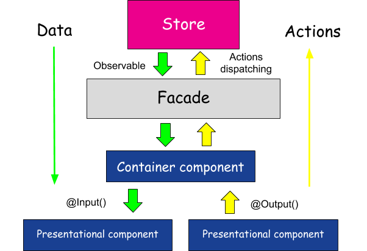

# Training

This project was generated with [Angular CLI](https://github.com/angular/angular-cli) version 7.0.1

## Development server

Run `ng serve` for a dev server. Navigate to `http://localhost:4200/`. The app will automatically reload if you change any of the source files.

## Code scaffolding

Run `ng generate component component-name` to generate a new component. You can also use `ng generate directive|pipe|service|class|guard|interface|enum|module|library|application`.

## Build

Run `ng build` to build the project. The build artifacts will be stored in the `dist/` directory. Use the `--prod` flag for a production build.

## Running unit tests

Run `ng test` to execute the unit tests via [Karma](https://karma-runner.github.io).

## Running end-to-end tests

Run `ng e2e` to execute the end-to-end tests via [Protractor](http://www.protractortest.org/).

## Running Docker

I added a docker compose file to make it easier to build off of and add additional services if you want

To get started run
```
ng build

docker-compose build
```
Then you can run
```
docker-compose up
```

## Resources

Angular heavily leverages both Typescript and RxJS. If you are unfamiliar with either of these projects, these resources can help you get up to speed.

For RxJS: [reactive-how](http://reactive.how/), [learn-rxjs](https://www.learnrxjs.io/)

For Typescript: [Typescript Docs](https://www.typescriptlang.org/docs/home.html)

## Interesting Projects

These are just some cool projects to use with an Angular application

For an example of a somewhat larger project and how it can be structured there is [ngx-admin](https://github.com/akveo/ngx-admin)

State Management: [NGRX](http://ngrx.github.io/), [NGXS](https://ngxs.gitbook.io/ngxs), or [Akita](https://netbasal.gitbook.io/akita/).

For Documenation: [Compodoc](https://compodoc.app/)

For Performance: [Immutability](https://facebook.github.io/immutable-js/), [Memoization](https://github.com/mgechev/memo-decorator), [Perfume](https://zizzamia.github.io/perfume/)

You may not want Angular material, but I highly recommend the [Component Development Kit](https://material.angular.io/cdk/categories) which can be pulled in separately

I used a crypto coin dashboard, but feel free to use whatever api you want [public apis](https://github.com/toddmotto/public-apis)

## Architecture Overview


```
My presentational components:

Are concerned with how things look.

May contain both presentational and container components** inside, and usually have some DOM markup and styles of their own.

Often allow containment via content projection.

Have no dependencies on the rest of the app, such as actions or stores.

Don’t specify how the data is loaded or mutated.

Receive data as inputs exclusively via props.

Rarely have their own state (when they do, it’s UI state rather than data).

Examples: Sidebar, Story, UserInfo, List.

My container components:

Are concerned with how things work.

May contain both presentational and container components** inside but usually don’t have any DOM markup of their own except for some wrapping divs, and never have any styles.

Provide the data and behavior to presentational or other container components.

Call actions and provide these as Inputs to the presentational components.

Are often stateful, as they tend to serve as data sources.

Examples: UserPage, FollowersSidebar, StoryContainer, FollowedUserList.

I put them in different folders to make this distinction clear.

Benefits of This Approach

Better separation of concerns. You understand your app and your UI better by writing components this way.

Better reusability. You can use the same presentational component with completely different state sources, and turn those into separate container components that can be further reused.

Presentational components are essentially your app’s “palette”. You can put them on a single page and let the designer tweak all their variations without touching the app’s logic. You can run screenshot regression tests on that page.

This forces you to extract “layout components” such as Sidebar, Page, ContextMenu and use content projection instead of duplicating the same markup and layout in several container components.

Remember, components don’t have to emit DOM. They only need to provide composition boundaries between UI concerns.

Take advantage of that.
- Dan Abramov (edited for Angular)
```

The architecture of a software system is a description of how to decompose it into pieces, how those pieces interact, and how that decomposition enables and constrains further development - Daniel Figueiredo and Renee Vrantsidis


When architecting an Angular application, a few considerations should be kept in mind.
1. One way data flow
    - Data should flow from a top down perspective
      - Passes data via @Input
    - Actions should flow up
      - Use @Output event emitters
    - The component that is 'routed' to is the 'facade' layer that handles pulling in all necessary services and actions, which will then pass necessary data and actions to container components
2. The Angular cli provides an easy way to get started with a monorepo structure that includes a component library. It is generally considered best practice to put 'presentation' components in the component library.
3. It is generally considered best practice to declare each component in it's own module which then also exports the component, this allows for the component to be used across the application freely among any other modules.
4. None of this is intended to get dogmatic about. Use this as a guide of best practices, ultimately the success of your project does not depend on any of these.

## Project Steps
Why Angular?
  - Single page apps provide a much richer user experience than traditional multi page web apps. 
    - a single page app does not require page reloads to load new content or perform actions. It is all on a single page which feels more like a native application.
    - Frameworks like angular, react and vue provide structure and modularity to your code. 
      - Angular is great at scale and for enterprise applications because once developers are working the angular way things are easily added or fixed and things stay organized.
      - Each of these frameworks has the idea of components and breaking things down. This is much more maintainable.
    - Progressive web apps are possible with the help from things like service workers. Take these combined with something like firebase and you can have a web app that runs the same offline as it does online.
  - You can take a framework such as ionic and reuse your web app code and port it to mobile or desktop. Check this tutorial out on how to port your angular app to MacOs, Windows, or linux and run as a native app. [Electron](https://angularfirebase.com/lessons/desktop-apps-with-electron-and-angular/ )
  - They are faster! If you use angular features such as lazy loading and the soon to be released Ivy renderer for angular. Your app can load almost instantly and navigating routes will be almost instant.
  

pre-reqs: Node v8 or greater. Angular cli installed globally (v7 preferrable)

1. Node installation
    - go to  [Node](https://nodejs.org/en/) and install the latest LTS version.
    - check that node is installed by entering node -v into your terminal if all goes well it should say v8.12.0 (or whatever the current version is)

2. Angular Cli Installation
    - Now that node is installed you can type the following command to install the Angular cli via npm (node package manager) globally. ``npm install -g @angular/cli`` (if you run into permission issues, you can alternatively try to install with [yarn](https://yarnpkg.com/en/))
    - Check that the cli installed by typing ``ng version`` If all went well you should see Angular Cli along with the version information.
    - Alternatively you can prefix ``npx`` (which ships with npm) to all ng commands rather than install the CLI
    
*side note: angular uses typescript for its language, you can find out more here about what typescript is and how to use it. [TypeScript](https://www.typescriptlang.org/docs/home.html)
 

1. Setup Project by using the angular cli (``ng new [project-name]``). Add angular routing, choose whatever styling you prefer.
2. Generate first component using the angular cli
    - First we need a module for the login page  (``ng generate module pages/login``)
    - Next we can generate the component (``ng generate component pages/login`` or shorthand `` ng g c pages/login``)
3. There are several different parts to a component such as, selector, template, styles, Lifecycle hook, logic. Each of these will be covered in more detail.

    - Selector, template, styles.
      - In the top of your new component you will see a decorator (@Component) This is a decorator for angular when it is compiling your Typescript. The decorator tells angular what to do with your class. For more info on the types of decorators available within angular, take a look [here](https://toddmotto.com/angular-decorators)
      - The full decorator looks like : ``@Component({
                                            selector: 'rcomyaccount-annual-receipt',
                                            templateUrl: './annual-receipt.component.html',
                                            styleUrls: ['./annual-receipt.component.scss']
                                          })``
      - The selector is how the element will be used within another angular component. So in the view / HTML of a different component you could put ``<rcomyaccount-annual-receipt></rcomyaccount-annual-receipt>`` and it would pull this component in.
      - The templateUrl is the path to the view or template which is an html file. Same thing with the styleUrls except they point to the stylesheet.
    - Lifecycle Hook
      - The lifecycle hook is an interface implementation (you can read the docs here: [Lifecycles](https://angular.io/guide/lifecycle-hooks)). Each component will implement at least one of these interfaces. The default is the ngOnInit which is called by angular and is run after the component is initialized by angular. You can place setup logic here for example that should be run on component initialization.
    - Logic
      - Inside the class and generally below the lifecycle hook you can write your class methods / functions that will contain the logic for your component. These are standard typescript functions and can be learned about here [TypeScript Functions](https://www.typescriptlang.org/docs/handbook/functions.html) 
4. Get component to render in our template
   - There are two basic ways to display a component.
      - Place the selector in the parent component (most simple way). In a new project this would be app.component.ts, you will go into the html file (the view) and place the selector for your new component (see previous step for info on a selector).
   - Display the component on a router outlet.
      - With angular being a single page app framework the browser will never leave the page while using the app. However users still need to navigate the app or use a nav. To accomplish swapping the view a router is used in angular. You can learn about the router here: [Angular Router](https://angular.io/guide/router) 
      - The most basic form of a route is essentially something like this `` { path: 'crisis-center', component: CrisisListComponent },`` This says that on the crisis-center path (``myapp.com/crisis-center``) display the CrisisListComponent.  You can see where you would place this route in the previous link to the documentation
      - lets add a route for our login page
        - in the login module at the top above the @NgModule decorator add ``const route: Routes = [
                                                                               { path: '', component: LoginComponent }
                                                                             ];``
        - You will also need to modify the the .forRoot in the login module to be .forChild
        - in the top level directory (app) add a app-routing module and in that put ``const routes: Routes = [
                                                                                        { path: '', pathMatch: 'full', loadChildren: '../app/pages/login/login.module#LoginModule'},
                                                                                      ];``
        - these two additions say that the root route will have the login module which displays the login component
5. Project setup (tsconfig/linter)
    - The example project in this github has some configs setup for you. These are the tslint.json and tsconfig.json these include basic settings for the way typescript compiles your project.
      - You will not need to make changes to ts config a whole lot except for if you wish to namespace file directory paths. This is not necessary but helps with imports so you dont have to type ../../../ to import a ts file. you can see these inside ``"paths": {`` in that tsconfig file.
    - The tslint.json file contains information for the typescript linter to know how strict you want the rules. Again you should not have to make changes here.
6. Create the Login Template (Use whatever makes sense to you), but a username and password are required to use the endpoint
    - Back in step 2 we created our first component. You can now go into the template (html file) that was generated by the cli when you created the component and add your html you will need a form and some input fields.
7. Create an authentication service to handle auth logic
    - A service is a way for a developer to make reusable code to fetch data or save data in angular. For example you may have several components that deal with signing a user into your app or logging the user out, or maybe reset password functionality. You would have a log in component, a log out component, and a reset password component. Each of these components could use a service for the previously mentioned logic.
    - in the previous example we could make an authentication service that would handle all of the logic such as signing a user in. Then in any component I could inject the service and use the functionality. A good explanation is found here: [Angular Services](https://angular.io/tutorial/toh-pt4) 
    - you can create your service by using the cli ``ng generate service services/auth``
    - You can then inject that service into a component by using the constructor, which will be covered in step 10
8. Add HttpClient to auth constructor for dependency injection, add HttpClientModule to the imports array for the AppModule
    - Go into your new auth service and inject the HttpClient, similar to how you did with your auth service ``constructor(private httpClient: HttpClient) { }``
      - The http client provides functionality to send requests to an api via REST. Find out more here: [HttpClient](https://angular.io/guide/http)
    - open the app module.ts file and add the HttpClientModule to the imports array, this allows you to use the httpclient in that module
9. Create a method to post the login url sending the username and password. (If you are using my auth endpoint the logins are admin: admin@axis, level1: level1@axis, or level2: level2@axis)
    - this method would be something like  ``public login(): Observable<HttpResponse<any>> {
                                               return this.httpClient.post('https://training-login-hcexbwcqjc.now.sh/login',{"username":"admin","password":"admin@axis"}, {observe: 'response'});
                                             } ``
    - The above method returns an observable of the http response this allows you to subscribe to the observable or use an rxjs operator on it. You can also use toPromise() to turn it into a promise. You can learn about observables [Here](https://angular.io/guide/observables) and rxjs [Here](https://rxjs-dev.firebaseapp.com/guide/overview)
10. Add the auth service to the constructor of the login component to pull it in via dependency injection
    - In your login component you made previously go into the constructor and add the auth service. 
      - ``constructor(private auth: Auth) { }``
      - Your service has now been injected and you can use any methods you have in the service (make sure they are public methods).   
11. Time to wire up the login method on our component to the auth service login.
    - Create a standard method in the login component class called login.
    - In this method call the auth service and call the login method in the service.
      - ``this.auth.login().subscribe( response => { console.log(response})``
    - As a challenge can you figure out how to change the login method to accept arguments from the template rather than be hard coded?
      - you can read up on [Data binding](https://angular.io/guide/template-syntax) and [Forms](https://angular.io/guide/reactive-forms) 
12. Once that's hooked up we'll need somewhere to route the user, create another page (call it whatever you want) and wire it up similar to the login page
    - See steps 2 - 4 on how to create a page / component and add routes.
    - For this new route, name it something like /home for the path in the app-routing module.
13. For navigation, I just used angular material schematics [Navigation Schematic](https://material.angular.io/guide/schematics)
14. The rest you can use the repo as a reference but I really encourage just making things that you want or think might be interesting. This is really just to get a barebones application up to see from a high level how things work and get wired together.
15. Have fun, feel free to reach out to me via slack with any questions.
